# MÁQUINAS VIRTUALES

## Ejercicio 1.  ¿Qué es la virtualización asistida por hardware o HAV (Hardware Assisted Virtualization)? Comparalo con la técnica de virtualización completa y paravirtualización.Comprueba finalmente, si esta característica está activada en tu ordenador físico e indica como lo has averiguado adjuntado capturas del proceso. Cita al menos una fuente bibliográfica.

La virtualizacón completa simula un PC sin capa intemedia. Dentro de un mismo hardware podemos tener varias maquinas virtuales pero estás máquinas no son conscientes de que tienen un capa inferior. No existe un SO como tal que los gestione si no que se gestionan directamente con algun tipo de software, hypervisor de tipo 1 (siguiendo la misma nomenclatura que en en los apuntes). Sin embargo una paravirtualizacion se da cuando necesitamos un SO base con un gestor(aplicacion/programa) que gestiona las maquinas virtuales. Esta máquina virtual cualga de otro sistema operativo.

Primer paso abrimos el panel de control y pinchamos en programas, después programas y funcionalidades. En la parte izquierda encontramos “Activar o desactivar caracteristicas de windows” lo que desplegará una ventana emergente. En ella buscamos la carpeta “Hyper-V” y comprobamos si está activada.


Fuentes:

- [Diferencias entre Virtualización completa y Paravirtualización en Computación en la nube (huawei.com)](https://forum.huawei.com/enterprise/es/Diferencias-entre-Virtualización-completa-y-Paravirtualización-en-Computación-en-la-nube/thread/667217820116729856-667212887476809728)
- [Virtualización completa y paravirtualización: diferencias - Certitec ](https://certitec.eu/virtualizacion-completa-paravirtualizacion-diferencias/)


## Ejercicio 2. Realiza la siguiente actividad atendiendo a los siguientes puntos:

### 1. Investiga los requisitos mínimos necesarios para instalar Windows 11 e índicalos en la actividad, asi como la webgrafía o bibliografía de donde sacaste la información.
	
Los requisitos minimos para instalar windows 11 son.
- CPU: 1Ghz o más de velocidad con 2 o más núcleos. En la pagina de microsoft podemos acceder a una lista de CPU compatibles con este sistema.
- RAM: 4GB
- Almacenamiento: 64GB.
- Firmware del sistema: UEFI(Interfaz unificada de Firmware Extensible) Es necesario que el dispositivo(placa base + procesador) sea compatible con el arranque seguro1. En algunos casos en necesario actualizar (flashear) el firmware de la placa base, es necesario ver cada caso particular.
- TPM2: Necesaria la versión 2.0. 
- Tarjeta gráfica: Compatible con DirectX 12 o posterior con el controlador WDDM 2.0.
- Pantalla: Al menos de 720p y una diagonal mayor a 9”.
- Otros: Conexion a internet para actualizar el equipo. Si queremos actualizar el equipo a Win11 es necesario que esté ejecutandose Windows10

(El arranque seguro asegura que solo se ejecuten en el arranque software firmado. Esto evita que se ejecute software malicioso.)
(TPM son las siglas de Trusted Plataform Module, es un chip que debe venir instalado en tu placa base.Permite el alamacenamiento seguro y generación de claves criptográficas.)

Fuentes:

-[Windows 11 requisitos del sistema - Soporte técnico de Microsoft ](https://support.microsoft.com/es-es/windows/windows-11-requisitos-del-sistema-86c11283-ea52-4782-9efd-7674389a7ba3)

-[Requisitos de procesador de Windows | Microsoft Learn](https://learn.microsoft.com/es-es/windows-hardware/design/minimum/windows-processor-requirements)

-[Qué es el TPM y cómo comprobar si tu ordenador lo tiene para poder instalar Windows 11 (xataka.com)](https://www.xataka.com/basics/que-tpm-como-comprobar-tu-ordenador-tiene-para-poder-instalar-windows-11)

-[Windows 11 y inicio seguro - Soporte técnico de Microsoft](https://support.microsoft.com/es-es/windows/windows-11-y-inicio-seguro-a8ff1202-c0d9-42f5-940f-843abef64fad)


 ### 2. Crea una máquina virtual que se llame win11_nombre (siendo nombre tu nombre) de acuerdo a los requisitos donde instales este sistema operativo Windows 11. 

 #### 2.1  Documenta el proceso mediante capturas gráficas: tanto el  proceso de creación de la máquina como el de instalación del Sistema operativo.

 Partimos de la base de tener instalado [Oracle VM Virtual Box](https://www.virtualbox.org/wiki/Downloads). Para poder crear una máquina virtual necesitamos descargar el SO, para esto descargaremos la [ISO de Windows 11 desde](https://www.microsoft.com/es-es/software-download/windows11)la página de Microsoft.

 - Una vez abrimos el programa pulsamos en "*Nueva*".


-En la nueva ventana que nos abre, especificaremos el nombre y la ISO que vamos a usar para cargar el sistema operativo en esta máquina virtual. Elegimos la opcion desatendida(Si esta opción está activa el propio software se encarga de instalar por completo el SO si la tenemos desactivada tendremos que realizar nosotros todo el proceso a mano).


-En la siguiente ventana deberemos especificar los requisitos que vamos a destinar a este sistema. Como hemos comprobado anteriormente al menos necesitamos 4GB de memoria RAM y don núcleos 


Creamos un disco duro virtual para la maquina con, al menos 64 GB, 80 GB.


Por ultimo el programa nos enseña un resumen con las especificaciones de nuestra máquina virtual.


-Cuando pulsamos el boton terminar nuestra máquina esta creada y aparecera en la parte izquierda de la ventana. Pulsando el botoón  Iniciar  pondremos nuestra máquina en marcha.


Al pulsar iniciar aparece una nueva ventana, esta será nuestra máquina virtual y como no tenemos instalado windows todavía comenzaremos a instalarlo como si de una máquina completa ser tratase.Elegimos el idioma y pulsamos siguiente.


Aquí debemos introducir nuestra clave de producto, en este caso como es una prueba omitimos este proceso. La clave la introduciriamos en el campo señalado con la flecha pero nosotros pulsaremos en el area del circulo sobre *No tengo clave del producto.*


En esta ventana elegiremos que version queremos instalar en nuestro equipo. En nuestro caso elegiremos la version que viene marcada por defecto. Que es la Windows 10 Home 


Leemos y aceptamos los terminos de licencia y avisos aplicables. Marcamos la casilla conforme los aceptamos y pulsamos siguiente.


Elegimos la opcion avanzada para poder realizar las particiones que consideremos oportunas. En nuestro caso el espacio es demasiado limitado para hacer demasiadas puesto que tenemos 80 GB que en 2024 es un espacio mas que escaso. Pero entraremos en esta opcion para ver que nos permite.


Dentro de esta unidad creamos un nuevo volumen, dejaremos el valor que nos da por defecto que es el total. Aplicamos.


El instalador nos avisa de que windows creara unas particiones necesarias para el correcto funcionamiento del sistema. Aceptamos.
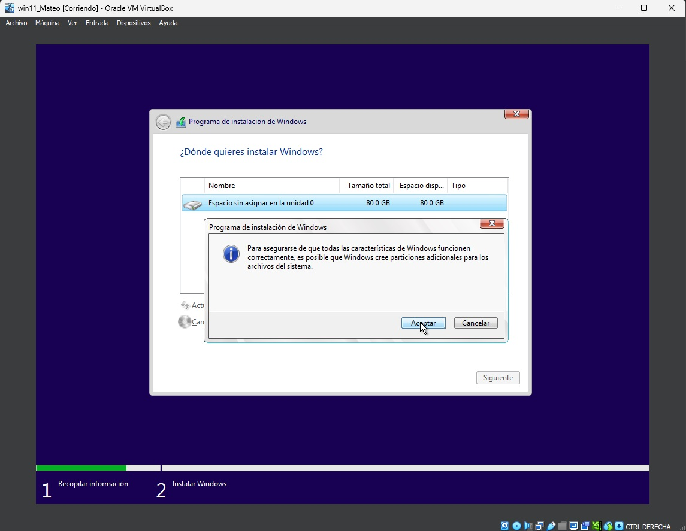

Como resultado el instalador crea tres particiones como se puede observar en la captura. Pulsamos siguiente.


Con esto todas las opciones antes de comenzar a instalar windows y arrancarlo por primera vez se han completado. Ahora solo nos queda esperar a que acabe de instalarse, se reinicie el equipo(MaquinaVirtual) y que comencemos a configurar nuestro sistema operativo.


La primera vez que arranquemos el sistema nos pedirá que confirmemos el idioma, la distribucion del teclado y le demos un nombre al equipo.


El proceso de instalacion desde este punto nos pedirá que introduzcamos un correo y creemos un usuario y contraseña. También nos dara a elegir si queremos mandar informes de errores o compartir nuestra ubicacion entre otras cosas. Es necesario registrarse con un correo y si no lo tenemos crearlo para poder arrancar el sistema. Aqui dejare varias capturas con todo este proceso.


Estos han sido todos los pasos que necesitamos para instalar Windows 11  en un máquina virtual desde cero.


### 2.2  En la documentación del proceso de creación de la máquina resalta aquellas configuraciones clave, según los requisitos mínimos que indagastes en el punto 1.

Los puntos resaltados en rojo son los mas importantes. Resumiendo lo crítico es tener en cuenta los requisitos minimos y al menos darle ese valor a cada uno de los parametro de la maquina virtual, si podemos darle mas recursos mejor.

## Ejercicio 3. ¿Qué es el módulo TPM? Realiza las capturas que sean necesarias para verificar si el ordenador del instituto dispone de este dispositivo y si lo tiene habilitado.

Ya lo he explicado a pié de pagina en la pregunta sobre los recursos minimos de windows 11. Pero el módulo TPM(Trusted Plataform Module) se encarga de dar seguridad a nuestro sistema, se encarga de almacenar claves de forma segura y de la generación de claves criprográficas.

## Ejercicio 4. ¿Qué significa que una distribución de Linux sea LTS? ¿Durante cuantos años tiene soporte una versión estándar LTS de Ubuntu? ¿ y con una suscripción Ubuntu Pro? Cita alguna de tus fuentes.

Las siglas LTS se refieren en inglés a Long Term Support (Soporte a largo plazo).Las versiones LTS de ubuntu tendrán soporte y serán actualizadas durante más tiempo que una versión normal. Estas versiones suelen ser más estables y estar más probadas. Se recomienda el uso de estas versiones desde varios foros sobre Ubuntu.

Las versiones normales tienen soporte sobre unos 9 meses, mientras que las versione LTS suelen tener soporte unos 5 años.

Con Ubuntu pro tendremos soporte durante 10 años.

Fuentes: 

-[FAQ: ¿Qué significa LTS? | Ubuntu Fácil (ubuntufacil.com) ](http://www.ubuntufacil.com/2014/03/faq-que-significa-lts/)


-[Cómo suscribirse a Ubuntu Pro y a la extensión del soporte (muylinux.com)](https://www.muylinux.com/2022/10/27/ubuntu-pro-tutorial-oficial/)


## Ejercicio 5. Realiza la siguiente actividad atendiendo a los siguientes puntos:

### 1  Averigua los requisitos de instalación de la versión LTS de Ubuntu 22 e indicalos en la actividad. Cita tus fuentes.

Para instalaciones fisicas los requisitos minimos son:
CPU: 2 núcleos, 2 Ghz.
RAM: 4GiB.
Alamcenamiento: 25GB de espacio en disco.
VGA: con capacidad de resolucion de 1024x768.
Un medio de instalacion, por ejemplo puerto USB.
Acceso a internet: Recomendable pero no imprescindible.
Tarjeta de video: Con capacidad de aceleracion 3D y al menos 256MB, es recomendable te	ner una tarjeta gráfica pero no imprescindible.

Para virtualizaciones los requisitos minimos son:
CPU: 1 núcleo, 2 Ghz.
RAM: 2 GiB.
Alamcenamiento: 25GB de espacio en disco.
VGA: con capacidad de resolucion de 1024x768.
Un medio de instalacion, por ejemplo puerto USB.
Acceso a internet: Recomendable pero no imprescindible.
Tarjeta de video: Es recomendable dedicar al menos 128MB de memoria.

Estos son los valores minimos para la virtualizacion. Obtendremos mejores resultados con 1 	GB mas de memoria ram y 2 nucleos de CPU.

Hay que destacar que la versión de escritorio requiere más recursos que la de servidor pues	to que necesita ejecutar el entorno de escritorio GNOME(GUI predeterminadad de ubuntu) 	mientras que la versión de servidor

Fuente: 

-[Requisitos mínimos de Ubuntu 22.04 (linux-console.net) ](https://es.linux-console.net/?p=10391)


### 2. Crea una máquina virtual en VirtualBox llamada Ubuntu22_nombre (siendo nombre tu nombre) que cumplan los requisitos que indicaste en el punto 

#### 1. Realiza las capturas necesarias (donde aparezca el nombre de la máquina para verificar la autoría de las tareas) y resalta en esas capturas la configuración o configuraciones clave de esa máquina según los requerimientos. 


Seleccionamos los valores que necesitamos en nuestro OS
como hemos visto en apartados anteriores, los requisitos minimos que necesitamos para poder virtualizar son:
    
- CPU: 2 núcleos, 2 Ghz.(1Núcleo,2Ghz VM)
- RAM: 4GiB.(2GiB VM)
- Alamcenamiento: 25GB de espacio en disco.
- VGA: con capacidad de resolucion de 1024x768.
- Un medio de instalacion, por ejemplo puerto USB.
- Acceso a internet: Recomendable pero no imprescindible.
- Tarjeta de video: Con capacidad de aceleracion 3D y al menos 256MB, es recomendable te	ner una tarjeta gráfica pero no imprescindible.

En nuestro caso vamos a sobredimensionar los recursos de nuestro sistema.
Marcamos la casilla de habilitar EFI como anota el ejercicio en el apartado 2.1.


Seguimos con el asistente, una vez definidas la memoria y CPU solo nos queda especificar el tamaño de disco de la máquina virtual.
El asistente nos enseñara un resumen de las especificaciones del sistema. 
Al acabar ya podremos elegir nuestra máquina en la parte de la izquierda.

#### 2.1 IMPORTANTE: habilita EFI en la placa base. ¿Qué hace esta característica?

### 3.Instala Ubuntu 22.04 en esa máquina, haz capturas de los pasos relevantes.

Una vez creada la VM pulsamos en iniciar. En este momento veremos un menu que nos da varias opciones la que nos interesa es  Try or Install Ubuntu. De este punto nos lleva a un asistente de instalación elegiremos instalar. Desde este punto seguimos respondiendo a las preguntas del asistente


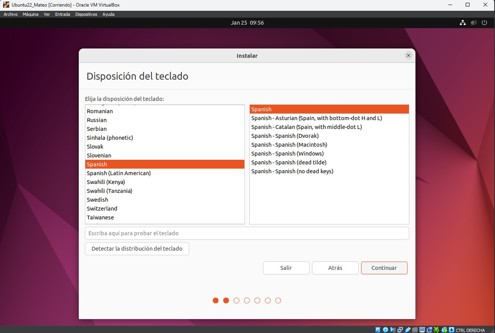

En nuestro caso instalaremos Ubuntu con las aplicaciones minimas. También es importante la casilla de descargar aactualizaciones al instalar Ubuntu.


En esta ventana elegimos borrar por completo el disco e instalar ubuntu porque partimos de cero. Al avanzar el asistente nos avisa mediante una ventana emergente  de que se crearan unas particiones necesarias para el sistema, muy similar a la instalacion de windows.


Seguimos configurando la zona horaria, el nombre del equipo, usuario y contraseña.


En este punto habremos finalizado la instalación. Solo nos queda reiniciar el equipo para arrancar nuestra maquina virtual Ubuntu.


Realizamos las ultimas actualizaciones una vez arrancado el sistema y ya tenemos operativa nuestras VM.


### 4.Instala Guest Additions. Realiza las capturas necesarias del proceso y cita tu fuente de referencia para esta instalación.


Una vez ejecutados estos comandos en la consola abrimos Dispositivos y pinchamos en Upgrade Guest Additions  a la derecha veremos una ventana que marca el avance de la instalacion. Una vez hecho esto podremos disfrutar de las ventajas de las guest addition para que se redimensione el tamaño de la pantalla de forma automatica entre otras ventajas.


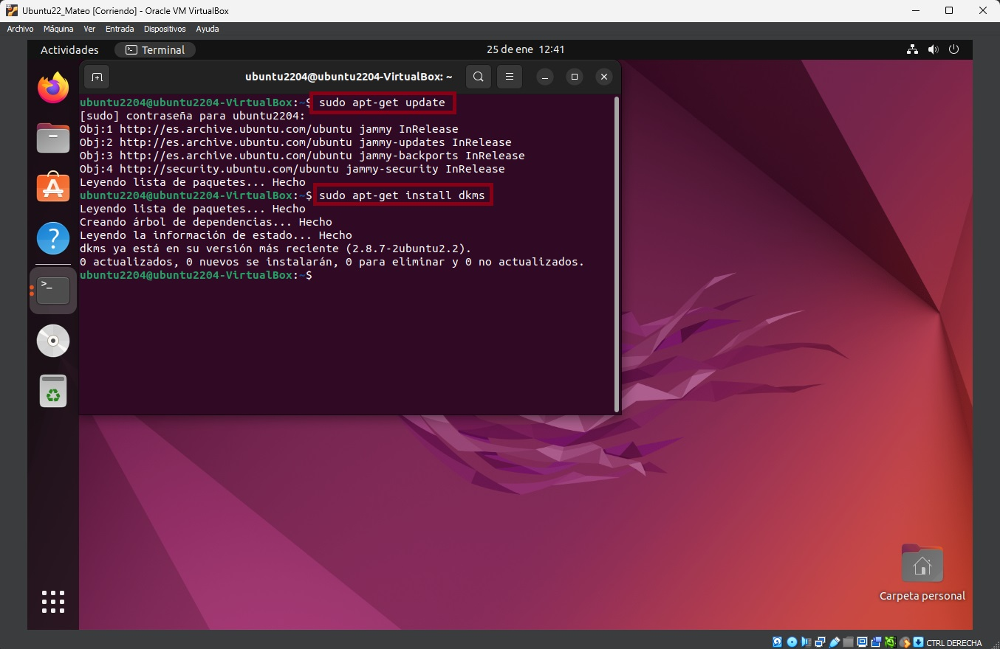


Fuente:

- [Cómo instalar las Guest Additions de VirtualBox (softzone.es) ](https://www.softzone.es/programas/sistema/instalar-guest-addition-virtual-box/)

## 6. Ejercicio 6.  Instala la utilidad gparted en la máquina de la actividad 5:
Abre un terminal y escribe lo siguiente (haz capturas de los 3 comandos):
``` sudo apt update ``` 
```  sudo apt upgrade -y``` 
``` sudo apt install gparted -y```


#### Abre la aplicación Gparted, realiza una captura y contesta:


#### ¿Cuántas particiones tienes?

Tengo un disco de 25GiB, con dos particiones (sda1,sda2) y 1 MiB sin asignar.

#### ¿Cuál es la función de la partición EFI System Partition y en qué punto de montaje está? ¿Qué tipo de sistema de archivos usa?

El firmware UEFI carga archivos en esta particion ESP(EFI System Partition) para inciar el 	sistema operativo instalado y diversas utilidades. Esto agilizar el proceso ya que se limita a 	escanear una sola unidad especifica en lugar de todo el sistema de cada vez.

Esta particion usa el sistema de archivos fat32 mientras que la otra particion(sda2) usa el sis	tema ext4.

#### ¿Cuál es la función de la partición montada en / ? ¿Qué tipo de sistema de archivos emplea?

Esta particion se encarga de servir de base para almacenar todo los datos requeridos por el sistema. Tambien sirvede partida para cada uno de los usuarios. 

Esta particion se llamara raiz y tiene un formato de archivos ext4.


## 7. Empleando la máquina de la actividad anterior, aumenta el tamaño del disco con VirtualBox 20GB más. Visualiza este espacio con Gparted y crea una nueva partición con este espacio empleando esta herramienta gráfica. Adjunta las capturas necesarias (p.e Modificación disco en VirtualBox, captura de Gparted con el nuevo espacio y verificación de la existencia de la nueva partición).

Partimos con este tamaño de disco y particiones en nuestra máquina virtual. Apagamos nuestra máquina virtual. Desde el administrador de virtual box vamos a Archivo>Herramientas>Administrador de medios virtuales.


Una vez hemos seleccionado esta opción nos lleva a una ventana donde podemos ver nuestras maquinas virtuales. Seleecionamos la máquina virtual que nos interese. Modificando el valor de la casilla o bien moviendo la barra podemos definir un nuevo tamaño de disco para la máquina.


Volvemos a nuestra maquina virtual, abrimos una terminal y introducimos el comando  gparted. El gestor nos avisa de que tenemos espacio sin asignar. Como se aprecia en las capturas disponemos de 20 GiB sin asignar, el espacio asignado desde el administrador de virtual box.


Podemos apreciar que tenemos 20GiB sin asignar. Hacemos click derecho sobre “sin asignar”.


Hacemos click sobre nueva, nos aparecerá una nueva ventana emergente para configurar este espacio.


Dejamos todos los valores por defectos para que 	esta nueva partición tenga todo el espacio dis	ponible, en  “Sistema de archivos” dejamos 	ext4  que es la opción por defecto. Pulsamos 	añadir para continuar con la asignación de este 	nuevo espacio.


Una vez salimos de la ventana anterior confir	mamos nuestras modificaciones en el espacio 	sin asignar pulsando en el boton verde que se 	indica en la captura de pantalla. También pode	mos hacerlo atraves de “Editar>Aplicar todas 	las operaciones”.


Cuando pulsamos el boton de “Aplicar todas las operaciones” aparece una venta emergente que nos pide confirmar que queremos realizar esta operación. Pinchamos en “Aplicar”, esperamos a Gparted  acabe y nos indica que el trabajo se ha realizado correctamente con una nueva ventana que nos enseña un resumen de las tareas realizadas.


Podemos ver que el proceso se ha realizado correctamente desde gparted o desde la terminal con el comando “lsblbk”


También podemos confirmar estas particiones con el comando 
```sudo fdisk -l ```

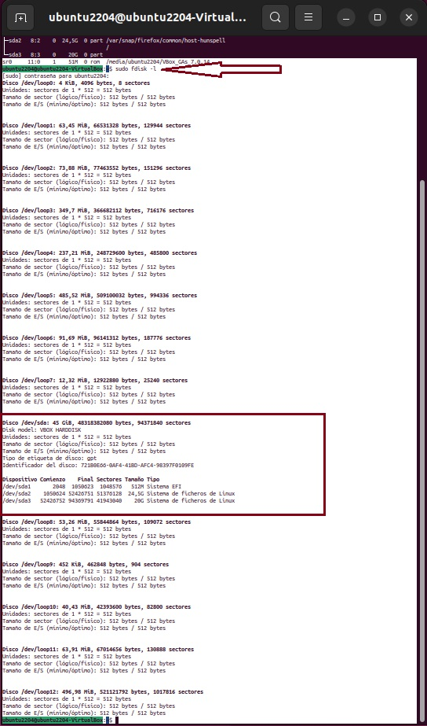

Fuente:
- [ Guía Paso a Paso de Cómo Aumentar el Tamaño del Disco de VirtualBox (wondershare.es) ](https://recoverit.wondershare.es/computer-problems/increase-virtualbox-disk-size.html)

## 8.Crea una nueva máquina Ubuntu llamada Ubuntu22_2_nombre. En este caso vamos a dale 4096MiB de RAM, 2 procesadores y 40GiB de disco duro. Durante esta instalación realizaremos el particionado del disco de forma manual de acuerdo al siguiente esquema:
```
/dev/sda1 		tipo UEFI 				512MiB 
```
```
/dev/sda2 		tipo ext4 		/		15GiB 
```
```   
/dev/sda3 		tipo ext4 		/home	resto
 ```
## Adjunta las capturas necesarias que documenten cada punto solicitado y que aparezca el nombre de la máquina para verificar la autoría de las tareas.


Creamos una nueva máquina, adjuto captura para poder ver ques es otra máquina con las especificaciones que nos requiere el ejercicio. Elegimos la opcion de instalar de forma manual el OS y habilitamos el EFI como en la máquina creada anteriormente.
Arrancamos la máquina para comenzar con la nueva instalación. En la ventana de “Tipo de instalación” elegimos “más opciones” esta opción nos permite definir las particiones de nuestro disco de forma manual para adaptarlo a las especificaciones del ejercicio.


Pulsamos sobre “Nueva tabla de particiones” confirmamos la ventana emergente


Hacemos clic derecho sobre “espacio libre” y elegimos “nueva”. En la venta emergente elegimos:
Para dimensionar todas las particiones haremos la conversion de MiB a MB por eso las cantidades destinadas a cada particion no coinciden con las del enunciado.

1. Tamaño 537 MB. En utilizar como elegimos “Partición del sistema «EFI»”.
2. Tamaño 15729 MB. En utilizar escogemos “sistema de ficheros ext4 transacional”. En punto de montaje escogemos la raíz “/”.


3. Tamaño resto del espacio. En utilizar “sistema de ficheros ext4 transacional”.Punto de montaje “/home”.


Una vez realizadas todas las particiones elegimos continuar y nos informa de todas las particiones realizadas y nos pide confirmacion para comenzar el proceso de instalación. Reiniciamos y ya tenemos nuestro sistema instalado.


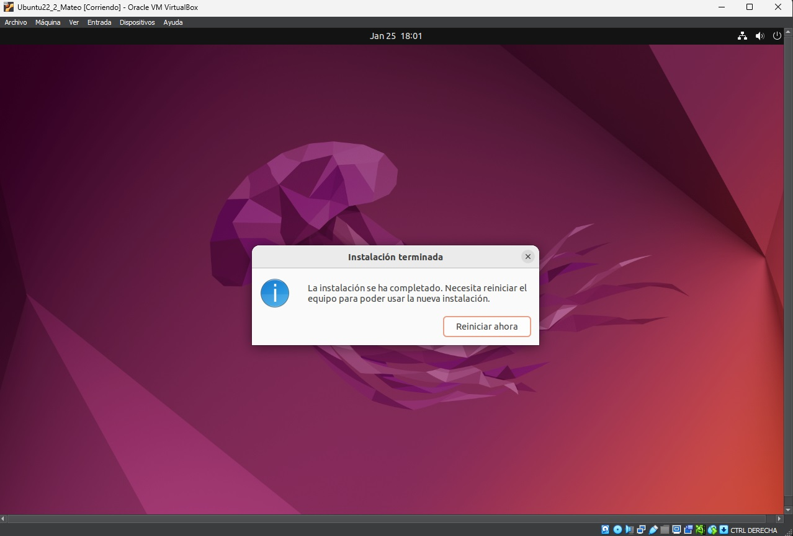

## 9.Investiga que es un gestor de arranque y para que se emplea:
### 9.1 ¿Qué gestor de arranque emplea Windows?### 9.2 ¿Qué gestor de arranque emplean las distribuciones Linux?

Un cargador de arranque (Bootloader) es un programa que permite elegir el si	guiente codigo a ejecutar en el proceso de arranque. Al terminar el proceso de arranque se llama a un programa, “bootloader” en inglés, para cargar en memoria el núcleo del sistema operativoy 	cederle el control de la máquina.

Este proceso era mas necesario con las BIOS puesto que era casi obligado su uso por las limitaciones en la MBR (siglas en ingles registro de arranque principal > Master Boot Record) para lanzar directamente el kernel. Con software UEFI  se podría lanzar directamente el kernel pero se sigue usando,gesto de arranque, debido a su versatilidad.

Un gestor de arranque (Boot Manager) contiene un menú simple que permite elegir el siguiente código a ejecutar. Normalmente el gestor de arranque forma parte del cargador de arranque.
Algunos ejemplos son GRUB, GRUB 2, LILO o SYSLINUX.
	
Windows usa BCD (Boot Configuration Data) mientras que las distribuciones Linux suelen usar GRUB  aunque algunas optan por otros gestores de arranque como LILO.

Fuentes:
- [Wikipedia](https://es.wikipedia.org/wiki/Gestor_de_arranque#:~:text=Un gestor de arranque (en inglés bootloader) es,ejemplo en GRUB%2C GRUB 2%2C LILO o SYSLINUX.)

-[SoftZone](https://www.softzone.es/windows/como-se-hace/cambiar-orden-sistemas-operativos-encender-pc/)

## 10. 10. Empleando la máquina Ubuntu22_2_nombre de la actividad 8, realiza los siguientes pasos:

1. Abre un terminal y escribe:
``` sudo -e /etc/default/grub ```


2. Cambia las siguientes líneas:
``` GRUB_TIMEOUT_STYLE=menu ```

```  GRUB_TIMEOUT=10 ``` 


3. Ahora pulsa:
```Ctrl + O ``` (pulsa Enter después)
``` Ctrol + X ``` (sales del editor guardando los cambios)

Escribe:
``` sudo update-grub2 ``` 
``` reboot ```


### Adjunta capturas de los pasos anteriores y contesta:
### ¿Qué cambio has realizado aplicando la configuración anterior?

La diferencia respecto a como funcionada antes el sistema es que cuando lo arrancamos nos aparece el menu de nuestro gestor de arranque  GRUB. En el menú podemos ver una lista en la que podemos seleccionar entre varias opciones. Si tenemos varios sistemas operativos podriamos elegir entre uno u otro.

### ¿Qué crees que hace la instrucción ``` GRUB_TIMEOUT_STYLE=menu ```? 

Al cambiar el parametro “hidden”  por el parametro “menu" hacemos visible esta seleccionque de la otra forma seguiría oculta para nosotros.a

### ¿ Y la instrucción ``` GRUB_TIMEOUT=10 ```?

Este parámetro nos indica el tiempo que tenemos el menú visible para poder tomar una decisión antes de que continue el proceso de arranque. Si volvemos a cambiar el parametro e introducimos el valor “30” podemos comprobar que se trata del tiempo que tenemos este menú en pantalla.


## 11. Empleando la máquina win11_nombre de la actividad 2, averigua en internet como emplear el gestor de arranque de Windows para que aparezca el menú de arranque cuando se enciende el ordenador y que tras 10 segundos de espera, entre en el SO por defecto si no se ha elegido ninguna opción.  Cita tus fuente/s y adjunta capturas de los puntos solicitados con el nombre de la máquina para verificar la autoría de las tareas.

Normalmente preferimos desactivarlo para acelerar el proceso de arranque del sistema. Si queremos ponerlo en marcha podemos realizarlo mediante la consola de windows (cmd) o bien entrando en las ventanas de System Properties.

1. Abrimos un nuevo CMD como administrador.


2. Escribimos el comando 
```bcdedit /set {bootmgr} displaybootmenu yes ```
``` bcdedit /set {bootmgr} timeout 30 ```


3. Resultado.


4. Si queremos desactivarlo solo deberemos escribir el comando 
``` bcdedit /set {bootmrg} timeout 0 ```.
Esto haría que no espera nada una vez muestre el menú o desactivarlo cambiando “yes” por “no” en la última parte del primer comando.

Fuente:
- [Gestor arranque Windows](https://www.reneelab.es/windows-boot-manager.html)

### Por último, emplea el gestor de arranque para hacer una copia del cargador del SO pero esta vez en safe mode o modo seguro. Realiza captura del gestor de arranque y del sistema operativo en modo seguro

Para añadir entradas en el menu de arranque de windows y configurar esta nueva entrada como arranque en modo seguro debemos seguir los siguientes pasos.
1. Abrimos una consola de Windows como administrador. Buscamos “cmd” pinchamos con click derecho y seleccionamos “Ejecutar como administrador”.  
2. Introducimos el comando « bcdedit /copy {current} /d "Windows 10 Safe Mode"». Entre comillas escribimos lo que queremos que aparezca en la entrada del menu, preferiblemente es mejor añadir nombres descriptivos.
3. La consola nos confirma que la orden se ha ejecutado correctamente con el mensaje “La entrada se copió correctamente en {dirección}”. El valor que muestre en los corchetes es necesario para el siguiente punto. Varía en cada caso.
4. Acto seguido ejecutamos el comando « bcdedit /set {dirección} safeboot minimal  ». Introducimos entre corchetes el valor entre corchetes que nos responda cmd en el punto anterior.


> [!WARNING] Podemos repetir estos paso configurando otras opciones como arranque seguro con funciones de red o modo seguro con el simbolo del sistema. Para realizar el arranque seguro con funciones de red seria repetir este proceso, cambiando la descripción y despues del punto 4 ejecutar el comando « bcdedit  /set {direccion} safeboot network ».Modo seguro con simbolo del sistema tendriamos que ejecutar « bcdedit  /set {direccion} safebootalternateshell yes » después del punto 4.

## 12. Empleando la máquina Ubuntu22_2_nombre de la actividad 8, realiza los siguientes pasos de los cuales has de adjuntar capturas donde se vea el nombre de la máquina para verificar la autoría de la práctica.Antes de la realización de esta actividad lee el documento adjunto: Sistemas operativos: gestión de archivos y almacenamiento.

### 1. Crea un nuevo disco duro en esta máquina de 20 GiB.

Hacemos click derecho sobre la máquina “Ubuntu22_2_Mateo” y pulsamos “configuración...”. En la lista de la izquierda pinchamos sobre “Almacenamiento” y después sobre “Controlador: SATA”nos aparecerá un icono de un disco con un simbolo “+”  en verde (al pausar el cursor sobre este icono se puede leer “Añadir un disco duro”).


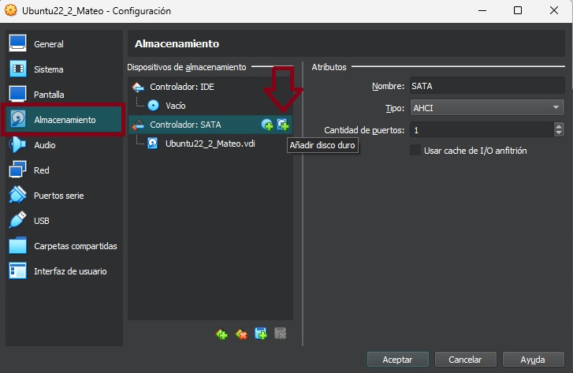

Ahora podremos crear un nuevo disco o añadir un disco existente. En nuestro caso pulsamos sobre “Crear”. Dejamos la extensión por defecto “.vdi”. NO reservamos completamente el espacio para el disco y especificamos el tamaño del nuevo volumen “20GB”.  Pulsamos “Terminar” para finalizar la creacion del disco.


Ahora solo nos queda añadir este nuevo disco que hemos creado a nuestra máquina, en mi caso “Ubuntu22_2_Mateo” Para esto pinchamos sobre el nuevo volumen sin asignar y pulsamos sobre ”Seleccionar” en la parte inferior de la ventana.


En esta ultima ventana se aprecia como la máquina ahora tiene dos discos, en captura anterior a esta podemos apreciar que solo aparecia uno.


### 2. Enciende la máquina y ejecuta el comando ``` fdisk -l ``` en un terminal y haz una captura. ¿aparece el nuevo disco?

Si, tanto si ejecutamos el comando ```fdisk -l``` como ```sudo fdisk -l```. se puede apreciar que tenemos dos discos “sda” y  “sdb”.


### 3. Usa el comando fdisk para crear una particion sobre el disco anterior. 

Antes de nada accedemos como superusuario con el comando ```sudo su``` introducimos nuestra contraseña y presionamos enter. Hecho esto ejecutamos el comando ```fdisk -l```. Esto listará todos nuestros discos con sus particiones, importante TRABAJAREMOS CON EL DISCO NO CON NINGUNA PARTICION SI ES QUE EXISTE ALGUNA EN Él. En nuestro caso el disco que vamos a particionar es el último que hemos añadido en el apartado anterior “sdb”.
Ahora ejecutamos el comando ```fdisk /dev/sdb``` esto abrira la herramienta fdisk para poder trabajar con este disco. Si escribirmos “p” y pulsamos la tecla enter nos dará una lista con todos los comandos que podemos ejecutar en esta herramienta y que hace cada uno de ellos. Escribimos “p”  y pulsamos enter, podemos confirmar que el disco no tiene ninguna partición creada.
Para crear nuestra nueva partición escribimos “n” en la terminal y nos pregunatará que tipo de partición queremos crear. En nuestro caso queremos una particion primaria “p” podriamos especificar todas las opciones que nos pregunta fdisk pero en este caso dejamos todos los valores por defecto. Confirmamos las modificaciones con la letra “w” y “enter”. Una vez hecho esto podremos salir con la letra “q” y cerrar la terminal.


Fuente:

-[fdisk. Cómo crear particiones en Linux desde la consola (galisteocantero.com)](https://www.galisteocantero.com/fdisk-como-crear-particiones-en-linux/)

### 3. Formatea la partición anterior con el sistema de archivos ext4 (trata de hacerlo desde el terminal):

Abrimos una nueva terminal, entramos como usuario y listamos las particiones con el comando ```lsblk```. Ahora introduciremos el comando ```mkfs.ext4 /dev/sdb1``` (mkfs.A /dev/sdXY  Donde A es el tipo de dato de la particion(ext3, ext4 etc) X es la letra asociada a este disco(a,b,c,...) en nuestro caso “b” e Y es la particion de este (1,2,3,...) en nuestro caso 1 porque solo hemos hecho una).


Fuente:
-[Cómo usar FDISK para formatear y revisar discos y particiones - Infranetworking](https://blog.infranetworking.com/como-usar-fdisk-para-formatear-y-revisar-discos-y-particiones/)

### 4. Crea una carpeta llamada sistemanuevo (mkdir sistemanuevo) y monta la partición.

En primer lugar nos situamos en el directorio donde queremos crear esta nueva carpeta/directorio. El comando que usaremos para esto es ```cd (change directory)``` si lo usamos escribiendo el directorio despues de cd entraremos en ese directorio, por ejemplo ```cd directorioAlQueQueremosEntrar``` o bien si queremos ascender en la rama de directorios usaremos los dos puntos “..” para subir un nivel ```cd ..```. Nos movemos hasta la raiz “/” y alli creamos la nueva carpeta con ```mkdir```. 
Una vez creada la carpeta montamos el disco con el comando ```mount /dev/sdb1 sistemanuevo```.  En mi caso como aplico el comando ```sudo su ``` no necesito escribir “sudo”(superuser do).


> [!WARNING]
me he equivocado a la hora de crear el directorio la primera vez por eso en la consola se como borro un directorio con el comando “rm -r sistemanuevo” (rm viene de remove, el guion indica una accion concreta dentro de el comando, en este caso “-r” indica que es recursica “recursive”  por lo que se elimina el directorio con todo lo que contega). Destacar el comando “pwd”(print working directory) y el comando “ls”(list). Comandos esenciales junto con “cd”(change directory). 


### 5. Por último escribe el comando ``` df -h ``` para listar los sistemas de ficheros que tenemos instalados.


Para asegurarnos de que los cambios se guardan debemos modificar el archivo  ``` fstab  ``` esto lo haremos con un editor de texto en la terminal. Escribimos el comando  ``` nano -w /etc/fstab  ``` esto nos abre este documento y nos permite modificarlo.
Para escribir un comentario solo debemos escribir “#” todo lo que vaya después en esa linea será un comentario. Ahora buscamos los datos que necesitamos con el comando  ``` blkid  ``` este comando nos permite ver el UUID de la particion que necesitaremos cuando abrimos el editor de texto y modificamos el archivo para asegurarnos de hacer los cambios de forma permanente.


Una vez realizadas las modifciaciones en el fichero. Guardamos los cambios con la tecla control mas O “CTRL + O” pulsamos “ENTER” y después “CTRL +  X” para salir. Podemos apreciar que en la parte inferior nos pide la confirmacion con enter,por eso debemos pulsarlo, sobre que archivo queremos modificar.

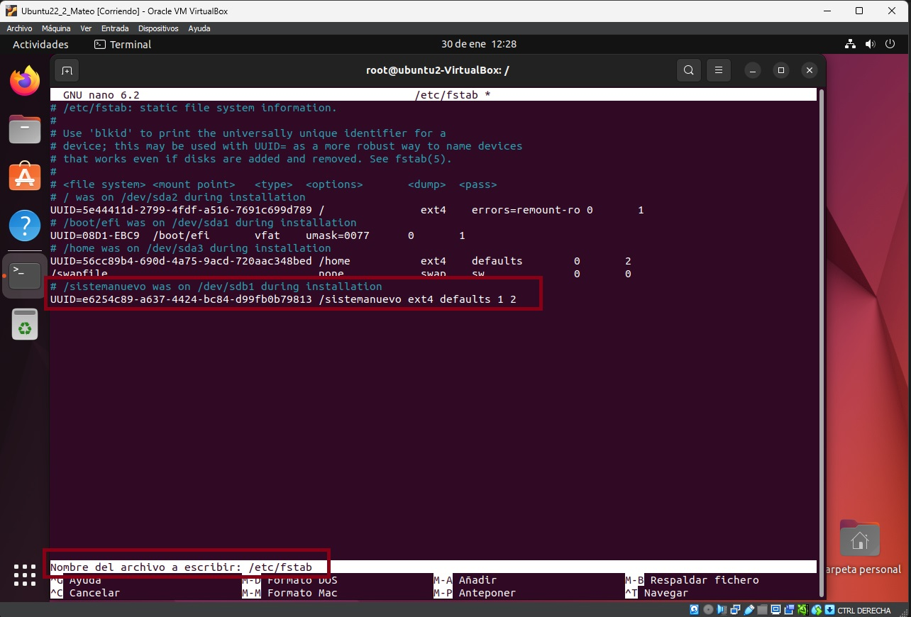


Reiniciamos mediante ``` reboot ``` para comprobar que los cambios se han realizado conrrectamente. Ejecutamos el comando ``` df -h ``` para comprobar que la particion se ha montado en el directorio que queremos de forma correcta.
El comando ``` df -h ``` significa (disk free) muestra el espacio en discos utilizado. Si añadimos la opcion ``` -h ```(human redable)  hacemos que muestre los datos de una forma mas legible para los humanos en lugar de los sectores.


## 13. Instala un sistema dual con Windows y Linux (Windows 11 y Ubuntu 22). Puedes aprovechar la máquina virtual Win11 del Ejercicio 2 o crear una de cero pero recuerda respetar los requisitos mínimos para cada SO en cuanto a disco, etc. Al finalizar la instalación debemos ser capaces de que el gestor de arranque nos deje elegir entre Windows 11 y Ubuntu 22. Adjunta las capturas necesarias donde aparezca el nombre de la máquina para verificar la autoría de la tarea y donde se vea que en el gestor de arranque se puede seleccionar el sistema operativo.

Para realizar esta tarea crearemos una nueva máquina virtual. En cuanto a los requisitos de la máquina estarán definidos en medida por Windows 11 puesto que sus requisitos son más altos que los de Ubuntu 22.04. En cuanto a almacenamiento debemos tener la suma de los mínimos de cada uno de ellos para que puedan convivir en el mismo disco duro.

| Left-Aligned  | Center Aligned  | Right Aligned |
|:------------- |:---------------:| -------------:|
| REQUISITOS         |   WINDOWS 11     | UBUNTU 22.04        |
| CPU        | 1GHz – 2 Núcleos – 64 bits|2 Ghz – 1 Núcleo         |
| RAM         | 4 GB      | 2 GB        |
| ALMACENAMIENTO        | 64 GB | 25 GB       |
| TARJETA GRÁFICA       | DirectX 12 | 1024x768       |
| UEFI       | TPM 2.0 Secure Boot | .      |
|CONEXIÓN A INTERNET | Requisito para actualizaciones | Recomendada para actualizaciones|

Remarcamos los valores clave que nos darán los recursos con los que vamos a crear nuetra máquina. Señalar que nuestro disco debe tener al menos 89GB, que redondearemos a 120GB.


Como hemos hecho en los ejercicios anteriores. Creamos una nueva máquina virtual. Empezaremos creando una maquina e instalandole Windows 11. 


   

En esta nueva ventana cambiamos los parametros de usuario y contraseña para introducir un nombre de usuario más significativo y una contraseña que recordemos con facilidad. Cabe destacar que ya nos pregunta de donde sacará las guest additions  que son las funcionalidades que hacen más amigable el trabajar con una máquina virtual. Facilita su uso(Captura de ratón y teclado junto con escalado de pantalla). Necesitamos marcar la casilla de Complementos de invitado.

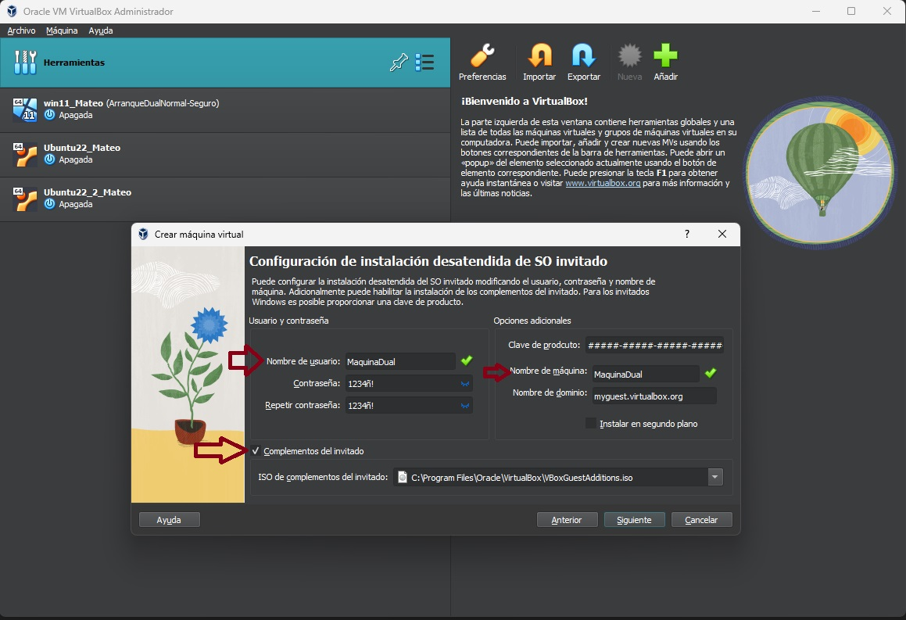

En los siguientes pasos configuraremos los componentes de nuestra máquina virtual basandonos en las especificaciones que hemos obtenido al principio del ejercicio.


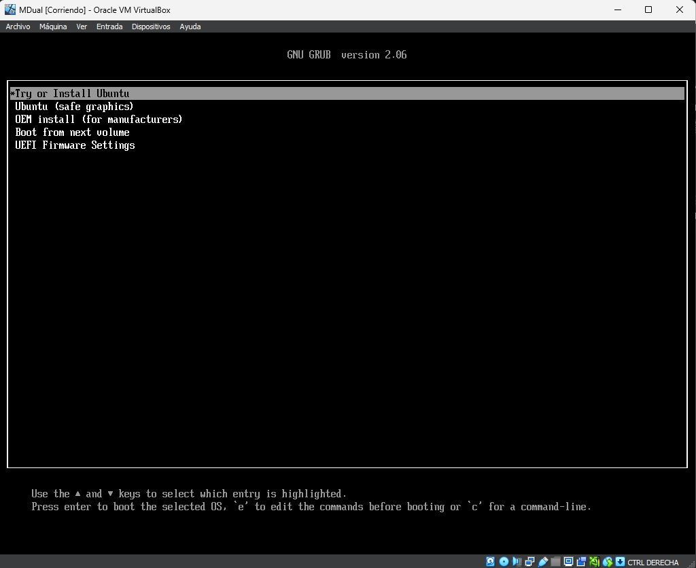

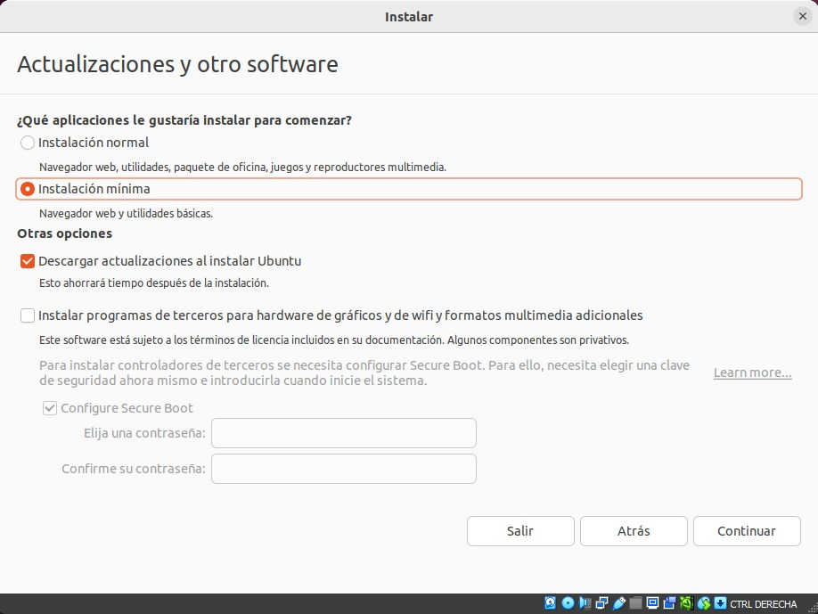

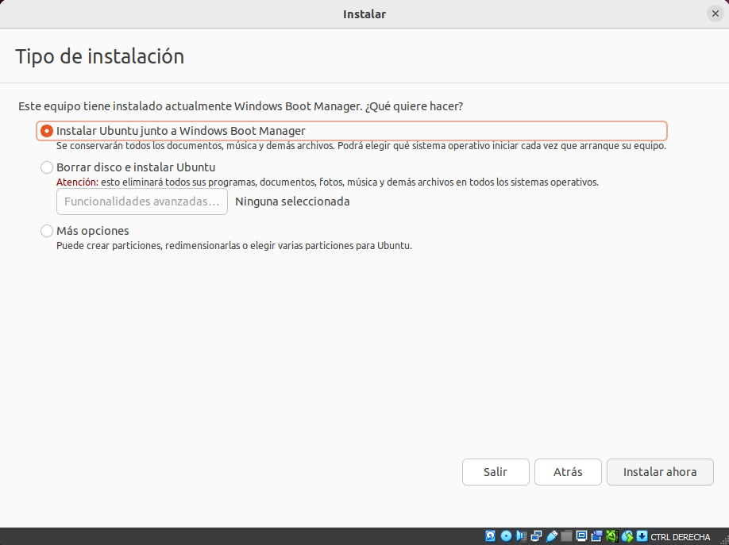


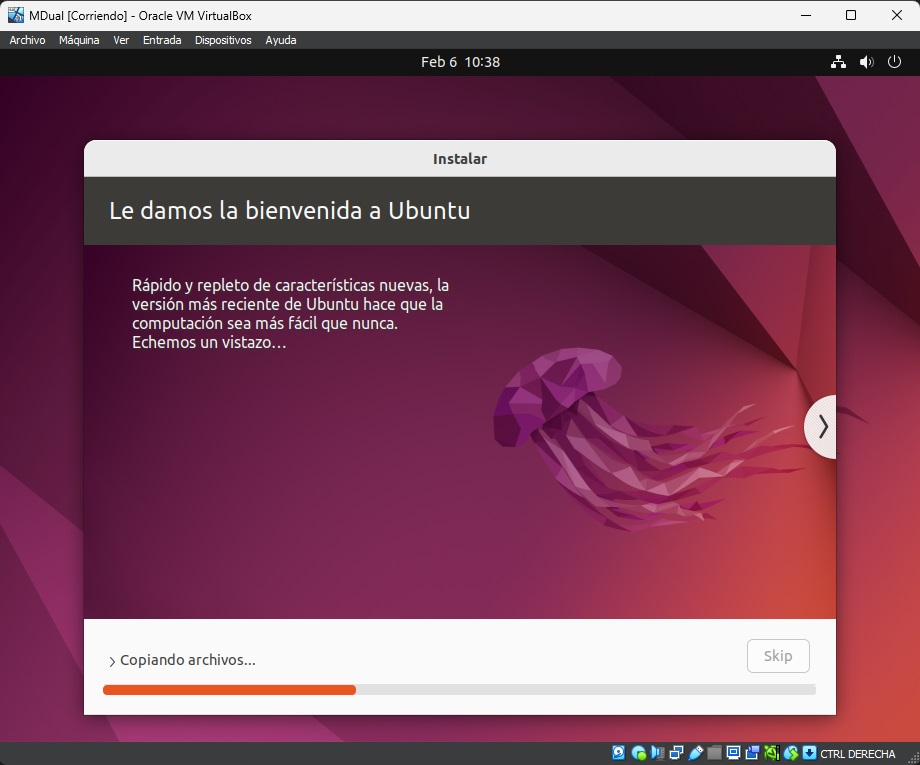


En este punto deberemos cambiar algunas partes de un archivo en ubuntu, Abriremos una terminal en linux y escribiremos “sudo su” y escribimos nuestra contraseña. Esto facilita los comando al no tener que escribir “sudo”  por cada instruccion que queramos usar superusuario. Una vez dentro del modo superusuario, escribiremos “ nano /etc/default/grub” 
esto nos abrirá un editor de texto en el que deberemos cambiar los paremetros de “GRUB_TIMEOUT_STYLE=menu” y “GRUB_CMDLINE_LINUX=”nomodeset”” en “GRUB_TIMEOUT=” escribiremos lo que queremos que se mantega en pantalla el menu de arranque. Pulsamos “CTRL + O”  para guardar y “CTRL + X” para salir del editor. Despues de esto al volver a la consola escribiremos “update-grub”. Ahora si ya podremos arrancar desde cualquiera de los dos sistemas de forma normal.


En este momento ya tenemos nuestros dos OS funcionales. Podemos personalizar las entradas que leemos en el menu con grub-customizer. Hay paginas especializadas en personalizar estos menus en las que podemos descargar, desde repositorios de github o gitlab, personalizaciones para el GRUB. 

[GRUB Themes - Gnome-look.org ](https://www.gnome-look.org/browse?cat=109&ord=rating)

[Cómo instalar GNU/Linux junto a Windows 11 en el mismo ordenador (xataka.com)](https://www.xataka.com/basics/como-instalar-gnu-linux-a-windows-11-ordenador)


