# Unidad didáctica 03. Introducción a los sistemas en red
## Módulo: Sistemas informáticos

### Tarea 1. Componentes de una red

En clase hemos visto diferentes componentes y medios de transmisión, pero hay algunos aspectos que únicamente se abordaron por encima. A continuación, realiza una investigación en Internet sobre los siguientes temas:

#### 1) Switch
- **¿Qué es un switch PoE?**

    Las siglas de switch PoE vienen del Inglés Power-over-Ethernet, que traucido sería algo como alimentado a través de Ethernet. La diferencia y principal ventaja respecto a un switch convencional es que además de transmitir datos proporciona alimentacion electrica a los aparatos que estén conectados a él. Podemos diferenciarlos entre activos y pasivos. Los primeros controlaran la tension de salida de la PSE (Fuente de alimentación). Los segundos darán una tensión constante.

    Existen 4 estándares de conformidad:

    1.PoE

    2.PoE+

    3.PoE++ y UPoE

    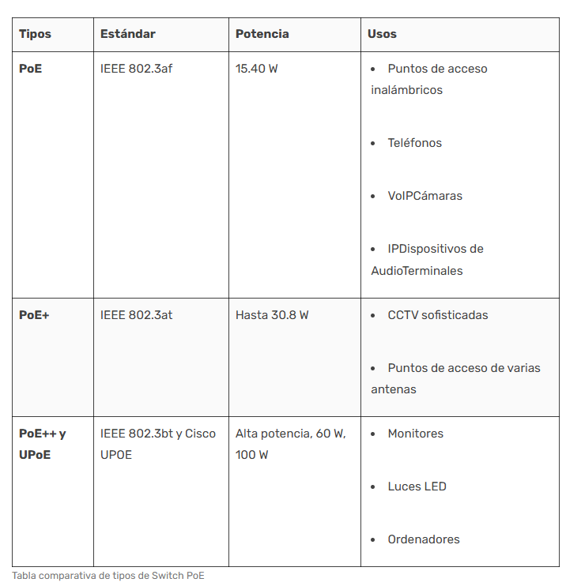

    **TP-Link TL-SG1005LP es un switch con 5 puertos Gigabit Ethernet, 4 de ellos PoE+, admite alimentación de hasta 30W por cada puerto PoE.**
    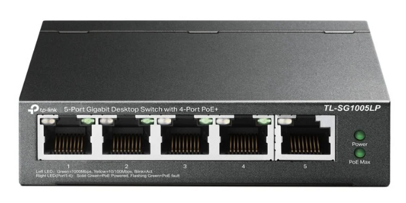
- **¿Cuáles son sus ventajas y sus inconvenientes?**

    Desde la popularización del internet de las cosas (IoT) este tipos de switches se han hecho muy populares. La mayor ventaja de estos dispositivos respecto a un switch convencional es que la instalacion es más simple, necesitamos menos cables para implementar la misma instalación, y esto implica un menor coste. Mejora considerablemente la gestion de cables y permite una mayor flexibilidad ante futuras modificaciones, puesto que no necesitamos un punto de conexión a red electrica cerca. 

    Una gran desventaja es que dependemos de la fuente de corriente, si por algun motivo se avería todos los dispositivos conectados quedarían inutilizados. Los dispositivos tienen un limite de distancia de trabajo de unos 100 metros.

- **¿Qué son los puertos SFP y para qué se utilizan?**

    Los puertos SFP (Small Form-Factor Pluggable) también conocidos como GBIC (Gigabit Interface Converter) son módulos conectables en caliente, sin apagar el dispositivo que los contiene, que se utilizan para transferir datos entre switches y otros dispositivos conectados. Se utilizan porque permiten elegir entre diferentes modulos para poder elegir entre distintos medios y velocidades de conexión.

    Ha habido 4 partes/tecnologías remarcables que son:

    - **SFP** , que es una version mejorada del GBIC con velocidades entre 100Mbps y 4Gbits/s.
    - **SFP+** velocidades de hasta 10Gbitps.
    - **SFP28** mismo factor de forma que el SFP+ pero velocidades hasta 25Gbitps.
    - **QSFP+** 4 canales simultaneos hasta 10Gbitps cada uno.
    - **QSFP28** 4 canales simultaneos hasta 25Gbitps cada uno.

    
    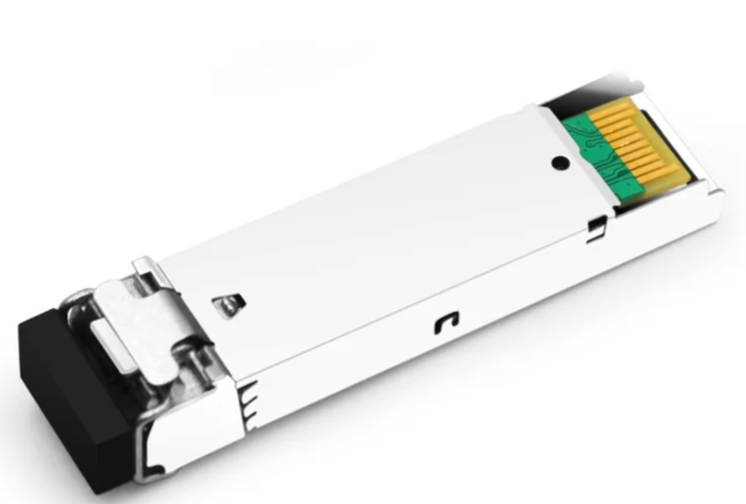
    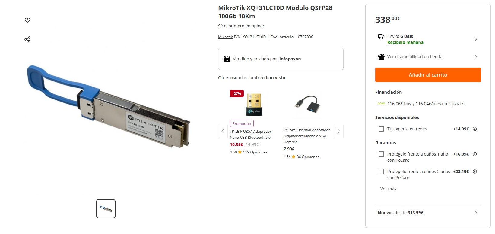
    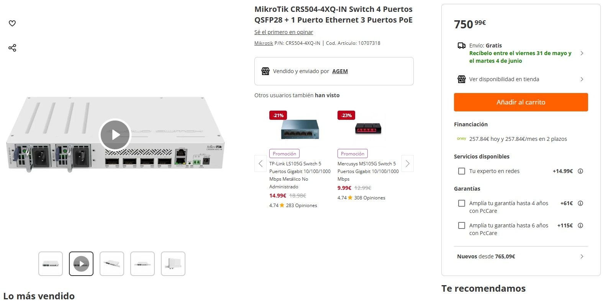
- **Fuentes**

    - [Switch PoE](https://www.vadavo.com/blog/switch-poe-que-es-y-que-tipos-hay/)
    - [Puertos y conectores SFP](https://www.fibermall.com/es/blog/what-are-the-sfp-and-qsfp-ports-of-switches.htm#:~:text=Los%20puertos%20SFP%20permiten%20a,de%20alta%20velocidad%20entre%20servidores)
    - [Tecnolgía FSP](https://community.fs.com/es/article/sfp-vs-sfp-vs-sf-p28-vs-qsfp-vs-qsf-p28-what-are-the-differences.html)

#### 2) Vimos lo que es un punto de acceso. Ahora, investiga:
- **¿Qué es un repetidor y para qué se utiliza?**
    Un repetidor Wi-Fi es un dispositivo que tiene como funcion principal ampliar la cobertura de la red inalámbrica. Se utiliza para prolongar la distancia util de la red Wi-Fi.

- **¿En qué se diferencia de un punto de acceso?**

    La diferencia es que el punto de acceso **CREA** la señal de red inalambrica original y el repetidor solo la propaga. Podemos usar un router wifi conectado a otro como punto de acceso, lo que prolonga nuestra red y **CREA** Wi-Fi en el nuevo punto donde conectemos este segundo router.

- **Fuentes**
- [Repetidor Wi-Fi](https://www.eluniversal.com.mx/techbit/que-es-y-como-funciona-un-repetidor-wifi/#:~:text=Un%20repetidor%20WiFi%2C%20amplificador%20o%20adaptador%20de%20Wi-Fi%2C,de%20forma%20correcta%2C%20explica%20el%20blog%20de%20Movistar.)

- [Punto de acceso](https://www.profesionalreview.com/2018/03/24/diferencias-repetidor-punto-de-acceso/#:~:text=Los%20puntos%20de%20acceso%20Wi-Fi%20crean%20la%20se%C3%B1al,aumentar%20la%20distancia%20de%20alcance%20de%20la%20red.)

#### 3) Esquema de Red Doméstica:
Utilizando los dispositivos intermedios vistos en clase, elabora un esquema sencillo de la red de tu casa. No es necesario que utilices las mismas imágenes o colores que el ejemplo proporcionado, pero debes incluir toda la información relevante en el esquema.

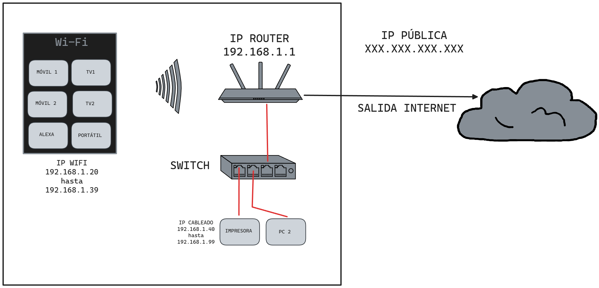

La direccion que necesitamos introducir en el navegador para acceder al router es la ip local que aparece en el esquema, sino tambien es muy cómun que por defecto tenga la direccion 192.168.0.1, esta direccion podemos cambiarla desde el mismo router al acceder a el.

Desde el router podemos asignar una direccion IP fija en funcion de la direccion MAC, unica para cada tarjeta de red. En realidad este router tiene varias frecuencias Wi-Fi de trabajo 2,4 GHz y 5GHz. La de mayor frecuencia es más rapida pero como parte negativa tiene menor alcance y le afectan más los obstaculos la otra es algo mas lenta. inapreciable para uso cotidiano, pero alcanza mejores distancias de funcionamiento y es mas estable si existen obstaculos entre el punto de acceso y el dispositivo que se conecta.

#### 4) Cable de Par Trenzado:
- **¿Qué tipos hay y en qué se diferencian?**
Antes de las clases es importante decir que los cables se entrelazan para evitar el ruido, señales no deseadas, y hacer asi mas seguro y fiable el medio de transporte para datos. Al entrelazar los cables conseguimos que las señales se anulen evitando así interferencias de unos cables sobre los otros.

Atendiendo a sus caracteristicas de fabricacion y materiales usados podemos distinguir:

1. **Cable UTP** (Unshielded Twisted Pair). Contiene pares de cable trenzado sin apantallar(blindar).Las parejas de cables no estan separadas las unas de las otras.
Suelen usarse para redes domesticas de corta distancia. Su impedancia característica es de 100 ohmios.

    
2. **Cable FTP**(Foiled Twisted Pair). En esta clase los pares trenzados estan separados por un material no conductor (plástico). El apantallamiento de este tipo de cables es global, es decir, aisla al conjunto de los pares trenzados y no a cada uno de ellos. Esta proteccion frente a señales no deseadas suele ser de aluminio. Su impedancia característica es de 120 ohmios.

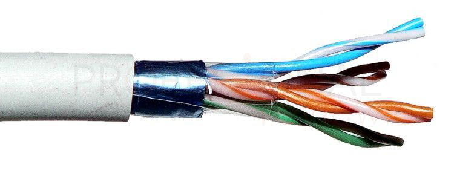

3. **Cable STP** (Shielded twisted pair). Como indica su nombre el apantallamieto es de cada par trenzado por separado, se utilizan en redes que requieren altas prestaciones. Se usan cuando los requerimientos son latencias muy bajas, alto ancho de banda y bajísimas tasas de error de bit. Permiten mayores distancias sin el uso de repetidores. Su impedancia tipica es de 150 ohmios. Suelen usarse con conectores RJ49(con aislamiento para evitar ruido).

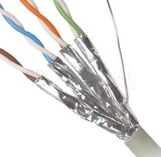

4. **Cable SSTP**(Screened Shielded Twisted Pair).  Es la union de las propiedades de los dos anteriores. En estos cables tenemos cada par apantallado y una malla que protege a todos los pares del cable. Las protecciones suelen ser de aluminio. Es el cable más caro de la lista pero tambien es el que obtiene las mejores prestaciones. Incluso esta conectado a tierra en los equipos para evitar tensiones residuales.

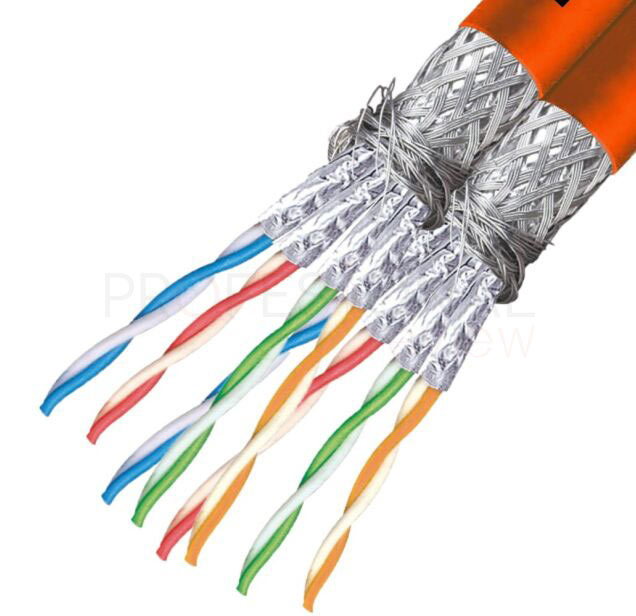
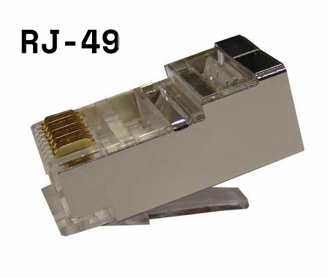

5. **Cable SFTP**(Screened Foiled Twisted Pair). Este cable sería la unión de un cable 
FTP, pero con una malla metalica por encima del apantallamiento global. Seguira la misma idea que el tipo anterior, por lo que la malla ira contectada a tierrar en los equipos evitando tensiones residuales.

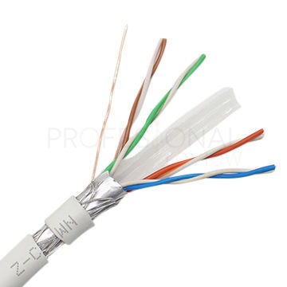

- **Existen diferentes categorías de cables de par trenzado. ¿Cuáles son? ¿Cuáles son sus características?**

En la siguiente tabla quedan especificadas las características de cada una de las categorías.

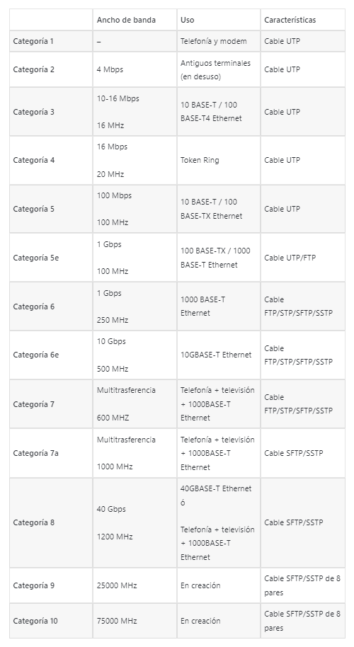

- **Fuentes**
-[Cables de par trenzado](https://www.profesionalreview.com/2019/01/26/cables-utp-cables-stp-cables-ftp/#:~:text=Tipos%20de%20cable%20de%20par%20trenzado%3A%20cables%20UTP%2C,FTP%205%20Categor%C3%ADas%20de%20cables%20de%20pares%20trenzados)

### Formato de Entrega
El documento debe entregarse en formato .PDF.

### Evaluación
No hay una extensión mínima, pero se valorarán aspectos como la presentación de los datos, el formato, el uso de imágenes explicativas, la correcta citación de fuentes y la inclusión de información de interés.
